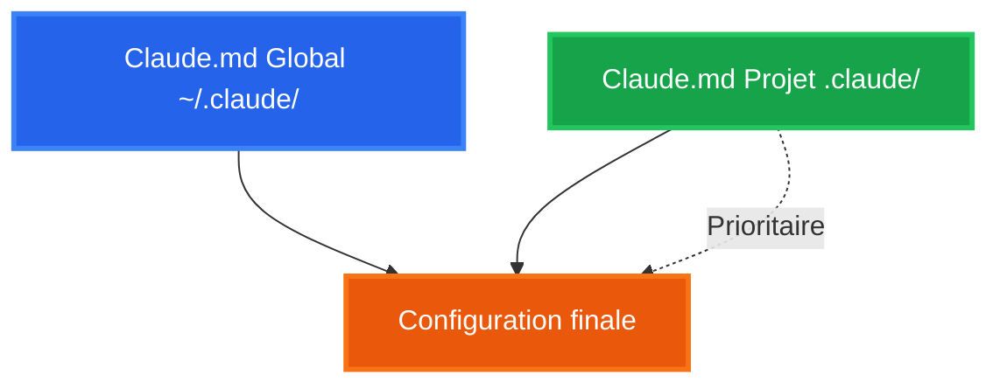

# Claude Code

Guide complet des fonctionnalités avancées

<div class="pt-12">
  <span @click="$slidev.nav.next" class="px-2 py-1 rounded cursor-pointer" hover="bg-white bg-opacity-10">
    Commencer <carbon:arrow-right class="inline"/>
  </span>
</div>

---
layout: center
---

# Claude.md

Configuration globale et par projet

---

# Claude.md - Configuration Globale

Fichier de configuration utilisateur : `~/.claude/CLAUDE.md`

<div class="mt-8">

**Avantages :**
- Instructions qui s'appliquent à **tous vos projets**
- Vos préférences personnelles de développement
- Standards de code que vous souhaitez toujours respecter

</div>

<div class="mt-8">

**Exemples d'utilisation :**
- Standards de nommage préférés
- Conventions de commits
- Règles générales de développement
- Préférences linguistiques

</div>

---

# Mon CLAUDE.md Global

Exemple concret de configuration personnelle

<div class="text-xs mt-4">

````md
# Master Rules
- **NEVER** add "Generated with Claude Code" to pull requests
- **NEVER** add Claude as co-authors to commits
- **NEVER** work directly on main - always create a feature branch
- Act and code with senior developer standards

## File Operations Strategy
**MCP JetBrains Priority**: Always attempt MCP JetBrains first

## Environment Setup
**PHP Execution**: Use Docker Compose for PHP commands
- `docker compose exec <container> php <command>`

## Git & Version Control
- **Create feature branches**: Never commit directly to main
- **Preserve commit history**: No amend, create new commits

## Code Modification Scope
**CRITICAL**: Only modify code related to the initial request
````

</div>

<div class="mt-4 text-sm opacity-75">
Fichier complet : ~/.claude/CLAUDE.md
</div>

---

# Claude.md - Configuration Projet

Fichier de configuration projet : `.claude/CLAUDE.md`

<div class="mt-6">

**Comment le créer ?**

```bash
/init
```

Claude génère automatiquement un fichier `.claude/CLAUDE.md` adapté à votre projet

</div>

<div class="mt-6">

**Avantages :**
- Instructions **spécifiques au projet**
- Partageable avec l'équipe via git
- Architecture et conventions du projet
- Contexte métier

</div>

<div class="mt-4 text-sm">

**Exemples :** Structure et architecture, conventions spécifiques, règles métier

</div>

---

# Hiérarchie des Configurations

<div class="mt-12">



</div>

<div class="mt-8">

La configuration **projet** a la priorité sur la configuration **globale**

</div>

---
layout: center
---

# Modes d'édition

Plan Mode & Accept Edit

---

# Modes d'édition

<div class="grid grid-cols-3 gap-6 mt-6">

<div>

### <span class="text-blue-400">**Plan Mode**</span>
Planification avant exécution

- Tâches complexes
- Todo list multi-étapes
- Validation d'approche

</div>

<div>

### <span class="text-green-400">**Accept Edit**</span>
Auto-approve

- Application automatique
- Workflow rapide
- Tâches simples

</div>

<div>

### <span class="text-orange-400">**Mode par défaut**</span>
Révision manuelle

- Accept / Reject / Edit
- Contrôle total
- Vérification avant application

</div>

</div>

<div class="mt-4 text-center text-lg">

**Raccourci :** <kbd class="px-3 py-1 bg-gray-700 rounded">[SHIFT] + [TAB]</kbd>

</div>

<div class="mt-4 flex justify-center">

<video autoplay loop muted width="70%" class="rounded shadow-lg" style="max-height: 200px;">
  <source src="/videos/edit-modes.webm" type="video/webm">
  Votre navigateur ne supporte pas la lecture de vidéos.
</video>

</div>

---

# Plan Mode en action

<div class="grid grid-cols-2 gap-4 mt-2">

<div>


</div>

<div>


<p class="text-xs mt-2 text-center opacity-75">Questions de clarification</p>

</div>

</div>

---
layout: center
---

# Extended Thinking

Raisonnement approfondi pour tâches complexes

---

# Extended Thinking

<div class="mt-4">

**Comment l'activer ?** Appuyer sur <kbd class="px-2 py-1 bg-gray-700 rounded">[TAB]</kbd> pour toggle ON/OFF

</div>

<div class="mt-4">

**Ce qui se passe :**
- Affiche le processus de réflexion en *texte gris italique*
- Raisonnement plus approfondi avant de répondre
- Intensité variable selon le prompt ("think", "think hard", "think longer")

</div>

<div class="mt-4">

**Quand l'utiliser ?** Planification architecturale complexe, debugging d'issues compliquées, évaluation de tradeoffs, compréhension de codebases

</div>

<div class="mt-4 flex justify-center">

<video autoplay loop muted width="70%" class="rounded shadow-lg" style="max-height: 200px;">
  <source src="/videos/thinking-mode.webm" type="video/webm">
  Votre navigateur ne supporte pas la lecture de vidéos.
</video>

</div>

---
layout: center
---

# Commandes Slash

Contrôle de la conversation

---

# /compact

Nettoyer et réduire la taille du contexte

<div class="mt-8">

**Usage :**
```bash
/compact
/compact [instructions de focus optionnelles]
```

</div>

<div class="mt-8">

**Ce que ça fait :**
- Résume et condense l'historique de conversation
- Réduit l'utilisation de tokens
- Préserve le contexte important
- Permet de spécifier un focus pour la compaction

</div>

<div class="mt-8 text-sm opacity-75">

**Quand l'utiliser :** Conversation longue qui consomme trop de tokens

</div>

---

# /resume

Reprendre une conversation précédente

<div class="grid grid-cols-2 gap-8 mt-8">

<div>

**Usage :**
```bash
/resume [conversation-id]
```

**Cas d'usage :**
- Continuer un travail interrompu
- Revenir sur un contexte précédent
- Reprendre après une pause
- Historique de sessions

</div>

<div class="flex items-center justify-center">

<video autoplay loop muted width="100%" class="rounded shadow-lg" style="max-height: 450px;">
  <source src="/videos/resume.webm" type="video/webm">
  Votre navigateur ne supporte pas la lecture de vidéos.
</video>

</div>

</div>

---

# /clear

Nettoyer la conversation

<div class="mt-8">

**Usage :**
```bash
/clear
```

</div>

<div class="mt-8">

**Utilité :**
- Nouveau départ avec contexte vide
- Résoudre des problèmes de contexte
- Commencer une nouvelle tâche
- Libérer la mémoire

</div>

---

# /rewind

Revenir en arrière dans la conversation

<div class="grid grid-cols-2 gap-8 mt-8">

<div>

**Usage :**
```bash
/rewind [n]
```

**Avantages :**
- Annuler des actions non souhaitées
- Revenir à un état précédent
- Tester différentes approches
- Corriger une mauvaise direction

**Exemple :**
```bash
/rewind 3  # Revient 3 messages en arrière
```

</div>

<div class="flex items-center justify-center">

<video autoplay loop muted width="100%" class="rounded shadow-lg" style="max-height: 450px;">
  <source src="/videos/rewind.webm" type="video/webm">
  Votre navigateur ne supporte pas la lecture de vidéos.
</video>

</div>

</div>

---
layout: center
---

# Référencement de fichiers

Utilisation du symbole @

---

# @ - Référencer des fichiers

Spécifier précisément les fichiers à traiter

<div class="grid grid-cols-2 gap-8 mt-8">

<div>

**Syntaxe :**
```bash
Modifie @src/components/Header.tsx pour ajouter...
```

**Avantages :**
- Ciblage précis des fichiers
- Évite les ambiguïtés
- Autocomplete intelligent
- Support des patterns (glob)

**Exemples :**
```bash
@package.json
@src/**/*.ts
@*.config.js
```

</div>

<div class="flex items-center justify-center">

<video autoplay loop muted width="100%" class="rounded shadow-lg" style="max-height: 450px;">
  <source src="/videos/file-reference.webm" type="video/webm">
  Votre navigateur ne supporte pas la lecture de vidéos.
</video>

</div>

</div>

---
layout: center
---

# MCP

Model Context Protocol

---

# MCP - Configuration

<div class="grid grid-cols-2 gap-6 mt-2">

<div>

**Fichier `mcp.json` :**

```json
{
  "mcpServers": {
    "context7": {
      "type": "http",
      "url": "https://mcp.context7.com/mcp",
      "headers": {"CONTEXT7_API_KEY": "xxx"}
    },
    "jetbrains": {
      "type": "sse",
      "url": "http://localhost:64342/sse",
      "headers": {"IJ_MCP_SERVER_PROJECT_PATH": "/path"}
    }
  }
}
```

<div class="mt-4">
<p class="text-sm font-bold" style="margin-bottom: 0.2rem;">Configuration MCP JetBrains</p>

</div>

</div>

<div style="font-size: 0.65rem;">

**Ajout CLI :**

```bash
claude mcp add <name> <cmd> [params]

claude mcp add filesystem -s user -- \
  npx -y @modelcontextprotocol/server-filesystem

claude mcp list / remove
```

**Commande /mcp** : Liste les serveurs MCP disponibles

<div class="mt-4">

<video autoplay loop muted width="100%" class="rounded shadow-lg" style="max-height: 250px;">
  <source src="/videos/mcp.webm" type="video/webm">
  Votre navigateur ne supporte pas la lecture de vidéos.
</video>

</div>

</div>

</div>

---

# MCP - Serveurs Utiles

<p class="text-sm">Liste de serveurs MCP recommandés</p>

<div class="mt-4 text-sm">

<div class="mb-3">
<span class="px-2 py-1 bg-blue-500 text-white rounded-full text-xs font-bold">Développement</span>
<ul class="mt-2 ml-4 text-xs">
<li><span class="px-2 py-0.5 bg-blue-100 text-blue-800 rounded font-bold">Serena</span> : Analyse sémantique de code et édition avancée (IDE-like)</li>
<li><span class="px-2 py-0.5 bg-blue-100 text-blue-800 rounded font-bold">Figma</span> : Accès aux designs Figma via API pour générer du code</li>
</ul>
</div>

<div class="mb-3">
<span class="px-2 py-1 bg-green-500 text-white rounded-full text-xs font-bold">Automatisation & Debugging</span>
<ul class="mt-2 ml-4 text-xs">
<li><span class="px-2 py-0.5 bg-green-100 text-green-800 rounded font-bold">Chrome DevTools</span> : Contrôle et inspection d'un navigateur Chrome en live</li>
<li><a href="https://browsermcp.io/" target="_blank"><span class="px-2 py-0.5 bg-green-100 text-green-800 rounded font-bold hover:bg-green-200">Browser</span></a> : Automatisation de navigateur cloud (screenshots, scraping)</li>
</ul>
</div>

</div>

<div class="mt-4 p-3 bg-orange-100 border-l-4 border-orange-500 rounded">
<p class="font-bold text-orange-800 mb-1 text-sm">💡 Tip : Créez vos propres MCP</p>
<p class="text-xs text-orange-900 mb-1">Demandez à Claude d'analyser vos besoins et de créer des MCP personnalisés :</p>
<p class="text-xs italic text-orange-800">"Analyse nos conversations et identifie les MCP qui amélioreraient ta fluidité et précision"</p>
<p class="text-xs mt-1 text-orange-700">Exemples créés : docker-compose-mcp, gotenberg-mcp, graphql-mcp</p>
</div>

---
layout: center
---

# Custom Commands

Créer vos propres commandes

---

# Custom Commands - Exemple /review-pr

Automatiser la review de Pull Requests

<div class="mt-8">

**Fonctionnement :**
1. Claude récupère la PR depuis GitHub
2. Analyse les commentaires de review
3. Lit le code modifié
4. Applique les corrections demandées

</div>

<div class="mt-8">

**Usage :**
```bash
/review-pr 123
```

</div>

<!--
Placer ici une vidéo démonstrative de /review-pr
Fichier : public/videos/review-pr.mp4
-->

---

# Custom Commands - Création

Créer vos propres commandes slash

<div class="grid grid-cols-2 gap-6 mt-4">

<div class="text-sm">

**Structure :**
```
.claude/
└── commands/
    └── review-pr.md
```

**Métadonnées disponibles :**
- `description` : Description de la commande
- `allowed-tools` : Outils autorisés sans confirmation
- `argument-hint` : Indice pour les arguments

<div class="mt-2 p-1 bg-blue-100 border-l-4 border-blue-500 rounded" style="font-size: 0.6rem; line-height: 1.2;">
<p class="font-bold text-blue-800" style="margin: 0;">💡 Tip : Laissez Claude créer vos commandes</p>
<p class="italic text-blue-800" style="margin: 0.1rem 0;">"Crée une commande /review-pr qui lit les commentaires d'une PR GitHub et applique les corrections demandées"</p>
<p class="text-blue-700" style="margin: 0.1rem 0 0 0;">Claude générera la commande complète avec toute la logique nécessaire !</p>
</div>

</div>

<div class="text-xs">

**Exemple complet - .claude/commands/review-pr.md :**

````markdown
---
description: "Read PR comments and update code"
allowed-tools: Bash(gh:*), Bash(git:*)
argument-hint: "[pr-number]"
---

# Analyze Pull Request Comments

Read all comments from the current PR
(or specified PR number), identify unresolved
feedback, and implement the requested changes.

## Context Commands
- Current branch: !`git branch --show-current`
- PR info: !`gh pr view $ARGUMENTS --json number`

## Instructions

### Step 1: Fetch PR Information
1. If no PR number in $ARGUMENTS, determine it:
   ```bash
   gh pr list --head $(git branch --show-current)
   ```
2. Otherwise use provided number
````

</div>

</div>

---
layout: center
---

# Sub-Agents

Agents spécialisés pour des tâches complexes

---

# Sub-Agents

Déléguer à des agents spécialisés

<div class="mt-2 p-2 bg-red-100 border-l-4 border-red-500 rounded" style="font-size: 0.75rem;">
<p class="font-bold text-red-800" style="margin: 0; font-size: 0.85rem;">⚠️ ATTENTION : Isolation des Sub-Agents</p>
<p class="text-red-900" style="margin: 0.2rem 0 0 0;">Les sub-agents <strong>n'ont PAS accès au contexte global</strong> de la conversation principale.</p>
<p class="text-red-900" style="margin: 0.2rem 0 0 0;">Le thread principal agit comme <strong>orchestrateur</strong>, mais chaque agent est complètement <strong>isolé</strong>.</p>
</div>

<div class="mt-4 text-sm">

**Qu'est-ce qu'un sub-agent ?**
- Agent Claude autonome avec une **spécialisation**
- Exécution en **parallèle** possible (3-5 agents simultanés)
- Contexte et objectif **focalisés**
- Rapport de résultats **structuré** à l'orchestrateur

</div>

<div class="mt-4 grid grid-cols-2 gap-4 text-sm">

<div>

**Quand utiliser un sub-agent ?**
- Tâches complexes nécessitant une **expertise spécifique**
- Analyse de **multiples fichiers** en parallèle

</div>

<div>

&nbsp;
- **Recherche approfondie** dans le codebase
- Génération de **documentation** ou **tests**

</div>

</div>

---
layout: center
---

# Skills

Compétences spécialisées et réutilisables

---

# Le problème avec les approches classiques

<div class="grid grid-cols-2 gap-6 mt-4">

<div>

### Tout dans CLAUDE.md

<div class="text-sm mt-4">

**Problèmes :**
- Fichier énorme (1500+ lignes)
- Claude charge **tout** à chaque conversation
- Consomme beaucoup de tokens inutilement
- Difficile à maintenir
- Tout est mélangé

</div>

<div class="mt-4 text-xs opacity-75">

Exemple : Guidelines frontend chargées même quand vous codez du backend

</div>

</div>

<div>

### Fichiers séparés

<div class="text-sm mt-4">

**Problèmes :**
- Claude doit penser à les lire
- Rappel manuel nécessaire
- Inconsistant
- Claude les oublie régulièrement

</div>

<div class="mt-4 text-xs italic opacity-75">

→ Vous devez dire : "Vérifie BEST_PRACTICES.md"

</div>

</div>

</div>

<div class="mt-6 text-center text-lg font-bold text-red-500">

Il nous faut une solution intelligente et contextuelle

</div>

---

# Skills - La solution

<div class="mt-6">

**Qu'est-ce qu'un skill ?**
- Instructions **chargées uniquement quand nécessaires**
- Contexte spécialisé (frontend, backend, tests, etc.)
- Réutilisable entre projets
- Activation automatique (via hooks)

</div>

<div class="mt-8">

**Comparaison avec CLAUDE.md :**

<div class="grid grid-cols-2 gap-4 mt-4 text-sm">

<div class="p-3 bg-red-100 border-l-4 border-red-500 rounded text-red-900">

**CLAUDE.md classique**
- 1500 lignes chargées
- Tout le temps
- Tokens gaspillés : 40-60%

</div>

<div class="p-3 bg-green-100 border-l-4 border-green-500 rounded text-green-900">

**Avec Skills**
- 300-400 lignes chargées
- Uniquement si pertinent
- Économie : 40-60% de tokens

</div>

</div>

</div>

---

# Chargement sélectif et progressif

<div class="mt-4">

**Exemple concret :**

<div class="grid grid-cols-2 gap-6 mt-6 text-sm">

<div>

**Travail sur contrôleur backend :**

```
✅ Skill "backend-dev-guidelines" (300 lignes)
   → Se charge automatiquement

❌ Frontend guidelines (1200 lignes)
   → Ne se charge PAS
```

<div class="mt-4 p-2 bg-green-100 border-l-4 border-green-500 rounded text-xs text-green-900">

Tokens consommés : 300 au lieu de 1500

</div>

</div>

<div>

**Travail sur composant React :**

```
✅ Skill "frontend-dev-guidelines" (400 lignes)
   → Se charge automatiquement

❌ Backend guidelines (1100 lignes)
   → Ne se charge PAS
```

<div class="mt-4 p-2 bg-green-100 border-l-4 border-green-500 rounded text-xs text-green-900">

Tokens consommés : 400 au lieu de 1500

</div>

</div>

</div>

</div>

<div class="mt-6 text-center text-base font-bold text-green-600">

Économie de tokens : 40-60% selon le contexte

</div>

---

# Structure d'un skill

<div class="grid grid-cols-2 gap-6 mt-4">

<div class="text-sm">

**Structure avec ressources :**

```
.claude/skills/
└── frontend-dev-guidelines/
    ├── SKILL.md (398 lignes - toujours chargé)
    └── resources/
        ├── react-hooks.md
        ├── tanstack-query.md
        └── mui-patterns.md
```

<div class="mt-4 p-2 bg-blue-100 border-l-4 border-blue-500 rounded text-xs text-blue-900">

**SKILL.md** : Résumé et règles critiques

**resources/** : Détails techniques chargés uniquement si nécessaire

</div>

</div>

<div class="text-xs">

**Exemple SKILL.md :**

```markdown
# Frontend Development Guidelines

## React Best Practices
- Utiliser hooks personnalisés pour logique réutilisable
- Préférer composition over inheritance
- [Détails complets](./resources/react-hooks.md)

## TanStack Query
- Toutes les requêtes API via TanStack Query
- [Guide complet](./resources/tanstack-query.md)

## Material-UI
- Design tokens via theme
- [Patterns MUI](./resources/mui-patterns.md)

## Règles critiques
- TypeScript strict mode obligatoire
- Tests unitaires pour composants critiques
```

</div>

</div>

---

# Auto-activation des Skills

<div class="mt-6">

**Le problème :** Skills inutiles si Claude ne pense pas à les utiliser

**La solution :** Hooks d'auto-activation

</div>

<div class="mt-8 text-sm">

**Comment ça marche ?**

1. Vous écrivez : *"Crée un nouveau contrôleur pour gérer les notifications"*
2. **Hook TypeScript** analyse le prompt AVANT que Claude le lise
3. Hook détecte le mot-clé *"contrôleur"*
4. Injecte automatiquement le skill `backend-dev-guidelines`
5. Claude reçoit le prompt + le skill actif
6. Claude crée le contrôleur selon VOS patterns

</div>

<div class="mt-6 p-4 bg-green-100 border-l-4 border-green-500 rounded">
<p class="font-bold text-green-800">Résultat : Code cohérent automatiquement, sans rappels manuels</p>
<p class="text-sm text-green-900 mt-2">Continuons avec la section Hooks pour voir comment configurer ce système...</p>
</div>

---
layout: center
---

# Hooks

Automatisation et contrôle qualité

---

# Qu'est-ce qu'un hook ?

<div class="mt-6">

**Définition :**

Un hook est un **script TypeScript** qui s'exécute automatiquement en réponse à des événements Claude Code.

</div>

<div class="mt-8 grid grid-cols-2 gap-6 text-sm">

<div>

**Événements disponibles :**
- `user-prompt-submit` : Avant que Claude lise votre prompt
- `assistant-response` : Après chaque réponse de Claude
- `file-edit` : Après modification de fichier
- `tool-call` : Avant/après appel d'outil

</div>

<div>

**Cas d'usage :**
- Auto-activation de skills
- Vérification automatique du build
- Formatage de code
- Tracking des fichiers modifiés
- Rappels de bonnes pratiques

</div>

</div>

<div class="mt-8 p-4 bg-blue-100 border-l-4 border-blue-500 rounded">
<p class="font-bold text-blue-800">Hook = Automatisation qui travaille en arrière-plan</p>
<p class="text-sm text-blue-900 mt-2">Claude n'a pas besoin d'y penser, c'est automatique</p>
</div>

---

# Hooks principaux

<div class="mt-4 text-sm">

<div class="grid grid-cols-2 gap-3">

<div>

<div class="p-1 bg-purple-100 rounded mb-1">
<p class="font-bold text-purple-800 text-xs">File Edit Tracker</p>
<p class="text-xs text-purple-900">Trace tous les fichiers modifiés pendant la session</p>
<p class="text-xs text-purple-700">Utilité : Savoir exactement ce qui a changé, facilite les commits</p>
</div>

<div class="p-1 bg-blue-100 rounded mb-1">
<p class="font-bold text-blue-800 text-xs">Build Checker</p>
<p class="text-xs text-blue-900">Vérifie les erreurs TypeScript après chaque réponse</p>
<p class="text-xs text-blue-700">Utilité : Zéro erreur laissée derrière</p>
</div>

</div>

<div>

<div class="p-1 bg-green-100 rounded mb-1">
<p class="font-bold text-green-800 text-xs">Error Handling Reminder</p>
<p class="text-xs text-green-900">Rappel gentil pour la gestion d'erreurs</p>
<p class="text-xs text-green-700">Utilité : Code robuste et sans oubli</p>
</div>

<div class="p-1 bg-orange-100 rounded mb-1">
<p class="font-bold text-orange-800 text-xs">Skill Auto-Activator</p>
<p class="text-xs text-orange-900">Analyse prompt et injecte skills pertinents</p>
<p class="text-xs text-orange-700">Utilité : Skills toujours actifs au bon moment</p>
</div>

</div>

</div>

</div>

<div class="mt-4 p-3 bg-red-100 border-l-4 border-red-500 rounded">
<p class="font-bold text-red-800 text-sm">⚠️ Note importante</p>
<p class="text-xs text-red-900">Hooks consomment des tokens. Utilisez-les judicieusement sur les projets importants.</p>
</div>

---

# Pipeline complet avec Hooks

<div class="mt-6">

**Workflow automatisé : #NoMessLeftBehind**

</div>

<div class="mt-6">


</div>

<div class="mt-6 text-center text-base font-bold text-green-600">

Résultat : Code cohérent, zéro erreur, sans intervention manuelle

</div>

---

# Configuration d'un hook

<div class="grid grid-cols-2 gap-3 mt-2" style="font-size: 0.65rem;">

<div>

**Fichier :** `.claude/hooks.json`

```json
{
  "hooks": [
    {
      "name": "build-checker",
      "event": "assistant-response",
      "script": "./hooks/build-checker.ts"
    },
    {
      "name": "skill-activator",
      "event": "user-prompt-submit",
      "script": "./hooks/skill-activator.ts",
      "config": {"rules": "./skill-rules.json"}
    }
  ]
}
```

</div>

<div>

**Exemple hook TypeScript :**

```typescript
// hooks/build-checker.ts
export default async function buildChecker(context) {
  const { files } = context;
  const tsFiles = files.filter(f => f.endsWith('.ts'));
  if (tsFiles.length === 0) return;

  const result = await exec('pnpm tsc --noEmit');

  if (result.exitCode !== 0) {
    return {
      message: "Build errors detected.",
      errors: result.stderr
    };
  }
}
```

</div>

</div>

<div class="mt-2 px-2 py-0.5 bg-yellow-100 border-l-4 border-yellow-500 rounded" style="font-size: 0.7rem;">
<p class="font-bold text-yellow-800" style="margin: 0;">💡 Tip : Laissez Claude créer vos hooks</p>
<p class="text-yellow-900" style="margin: 0;">"Crée un hook qui vérifie le build après chaque modification TypeScript"</p>
</div>

---
layout: end
class: text-center
---

# Merci !

Prêt à explorer Claude Code ?

